### Hexlet tests and linter status:
[](https://github.com/RomanVoronovskiy/java-project-61/actions)

## Описание проекта "Игры разума"
«Игры разума» — набор из пяти консольных игр, построенных по принципу популярных мобильных приложений для прокачки мозга. Каждая игра задает вопросы, на которые нужно дать правильные ответы. После трех правильных ответов считается, что игра пройдена. Неправильные ответы завершают игру и предлагают пройти ее заново. Игры:

+ Калькулятор. Арифметические выражения, которые необходимо вычислить.
+ Прогрессия. Поиск пропущенных чисел в последовательности чисел.
+ Определение четного числа.
+ Определение наибольшего общего делителя.
+ Определение простого числа.

Пользовательский выбор представлен ниже:
```text
  Please enter the game number and press Enter.
                1 - Greet
                2 - Even
                3 - Calc
                4 - GCD
                5 - Progression
                6 - Prime
                0 - Exit
```

### Пример выбора 1
+ положительный исход:
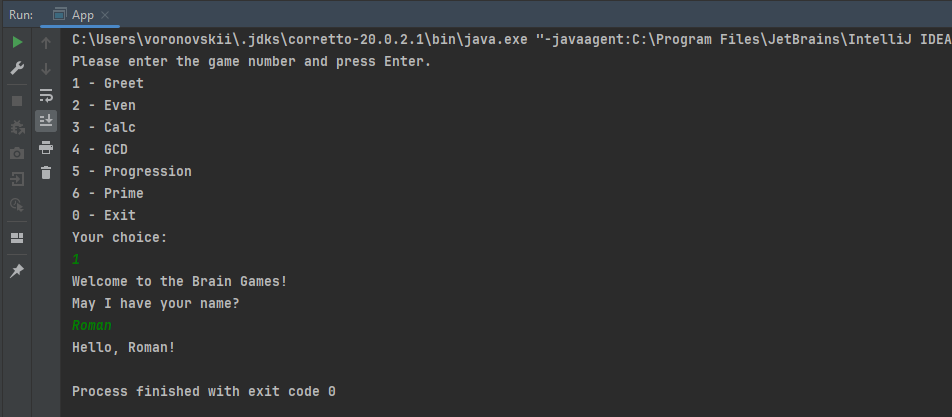
+ негативный исход:
  не предполагается
### Пример выбора 2
+ положительный исход:

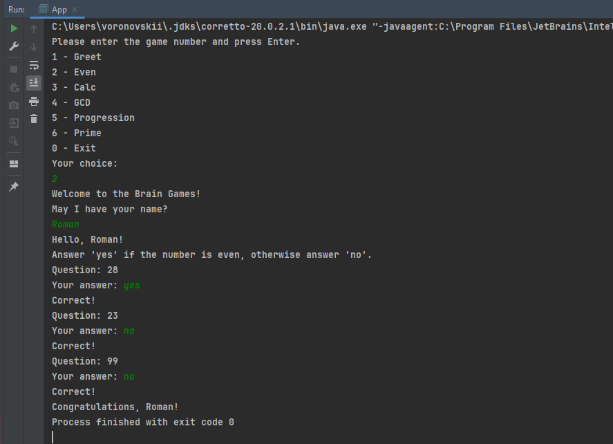
+ негативный исход:

  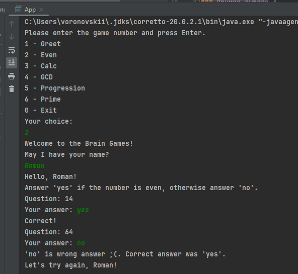
### Пример выбора 3
+ положительный исход:

  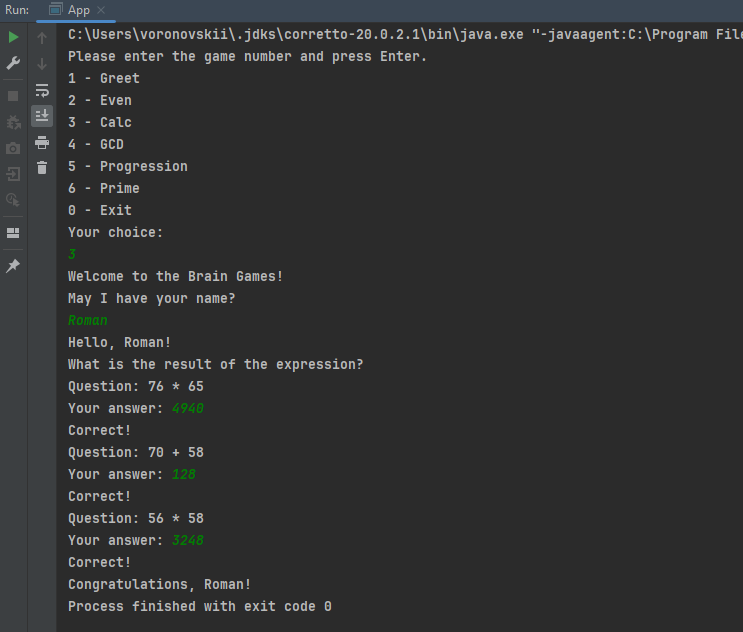
+ негативный исход:

  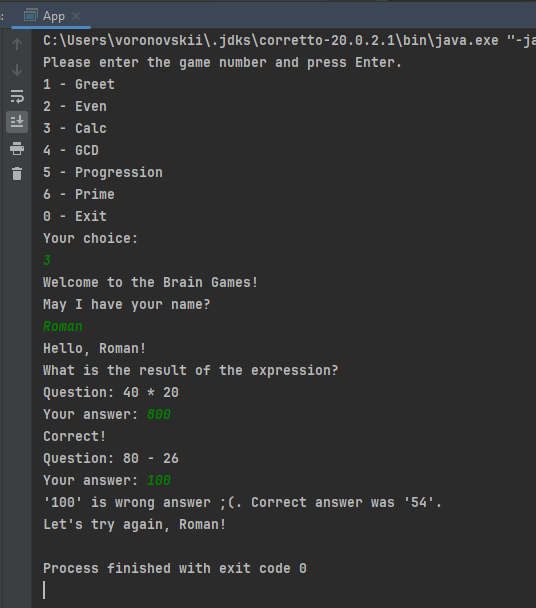
### Пример выбора 4
+ положительный исход:

  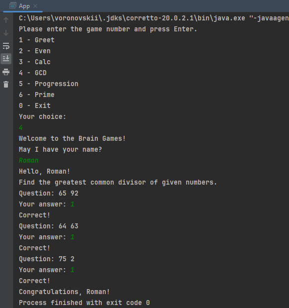
+ негативный исход:

  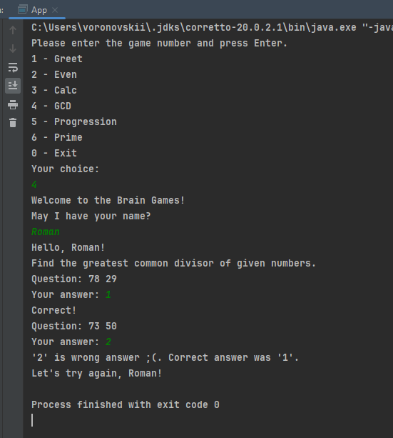
### Пример выбора 5
+ положительный исход:

  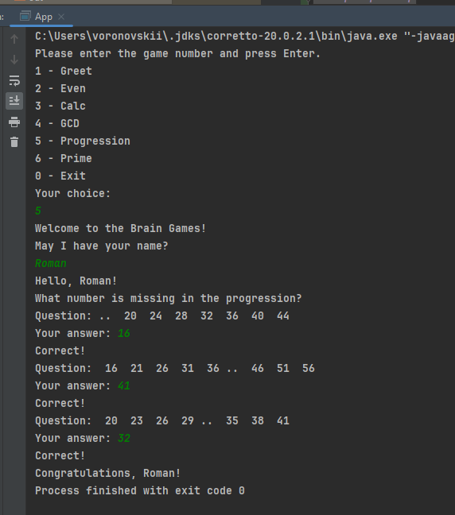
+ негативный исход:

  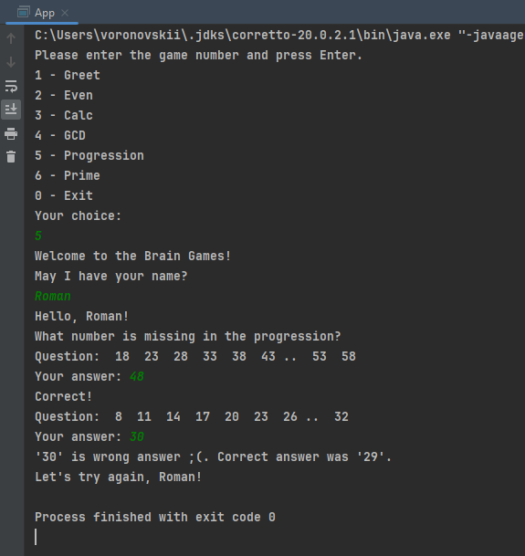
### Пример выбора 6
+ положительный исход:

  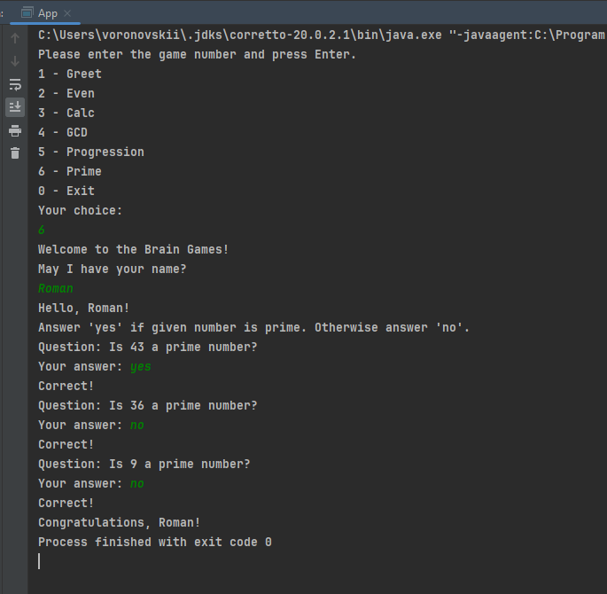
+ негативный исход:

  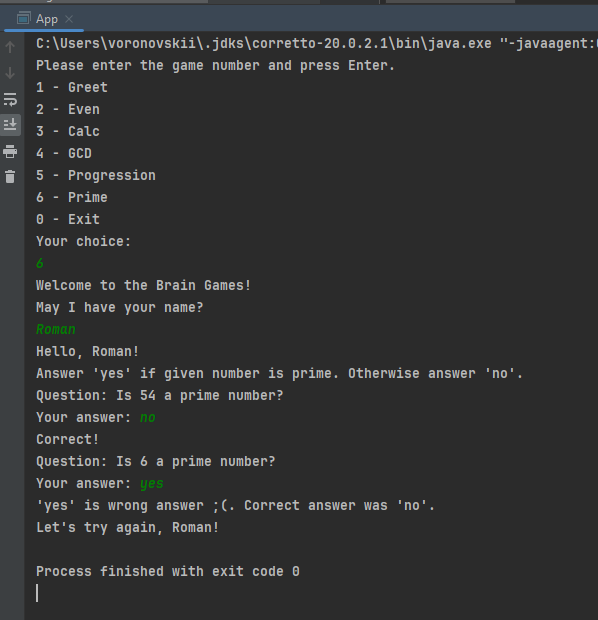
### Пример выбора 0
+ положительный исход:

  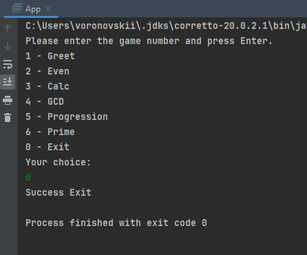
+ негативный исход: не предполагается

